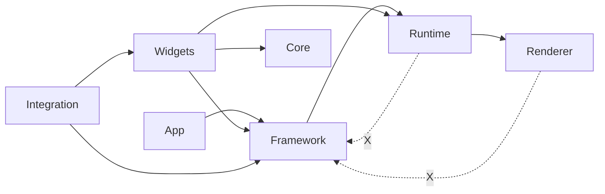

# RexUI 프레임워크 실행 잠금 문서 (Design Freeze + Skeleton)

## 0. 목적
- 이 문서는 **아키텍처 선확정 -> 구조 선생성 -> TODO 고정 -> 점진 구현** 프로세스를 잠그기 위한 기준 문서다.
- 본 단계의 코드는 구현 완료물이 아니라, 산업용 프레임워크 개발을 위한 골격/계약(Contract)이다.

---

## 1. 1단계 - Design Freeze

### 1.1 레이어 구조 확정
- Core
- Framework
- Runtime
- Renderer
- Widgets
- Integration

### 1.2 레이어 책임 경계
| 레이어 | 책임 | 금지사항 |
|---|---|---|
| Core | Widget 기본 수명주기, 이벤트 객체, 기하, 스타일 값 타입 | Framework/Runtime/Renderer 참조 금지 |
| Framework | 상태/바인딩/명령/입력/도킹/애니메이션/플러그인 정책 | Runtime/Renderer 구현 세부 로직 침투 금지 |
| Runtime | WidgetTree, Diff, Layout, Virtualization, DrawCommand 구성 | Framework 상태 정책 직접 구현 금지 |
| Renderer | DrawList 제출 및 GPU 백엔드 구현 | 상위 레이어(StateStore/CommandBus) 참조 금지 |
| Widgets | 재사용 위젯 및 Editor 위젯 인터페이스 | 엔진 모델 직접 수정 금지(Command 경유) |
| Integration | Editor 도메인과 RexUI 연결(ViewModel/Actions) | Renderer 코드 의존 금지 |

### 1.3 단방향 의존성 고정
- `App -> Framework -> Runtime -> Renderer`
- `Widgets -> Core/Framework/Runtime(필요 최소)`
- `Integration -> Framework/Widgets`
- 역참조 금지

### 1.4 인터페이스 우선 설계 고정
- 모든 신규 모듈은 헤더 인터페이스/시그니처를 먼저 확정
- 구현은 TODO 단계별 착수 전 금지
- 공개 API 변경은 Design Freeze 문서 변경 승인 후에만 허용

### 1.5 의존성 그래프


---

## 2. 2단계 - 전체 폴더/파일 선생성

### 2.1 전체 폴더 구조
```text
Engine/UI/RexUI/
  Core/
  Framework/
    Declarative/
    State/
    Binding/
    Commands/
    Input/
    Docking/
    Animation/
    Plugins/
  Runtime/
    Tree/
    Diff/
    Layout/
    Virtualization/
    Render/
  Renderer/
    OpenGL/
    Vulkan/
  Widgets/
    Basic/
    Editor/
  Integration/
    EditorBridge/
```

### 2.2 전체 파일 목록
```text
Engine/UI/RexUI/Core/ElementId.h
Engine/UI/RexUI/Core/Event.h
Engine/UI/RexUI/Core/Geometry.h
Engine/UI/RexUI/Core/StyleValue.h
Engine/UI/RexUI/Core/Widget.h
Engine/UI/RexUI/Framework/Animation/Easing.h
Engine/UI/RexUI/Framework/Animation/Timeline.h
Engine/UI/RexUI/Framework/Animation/Transition.h
Engine/UI/RexUI/Framework/Binding/BindingContext.h
Engine/UI/RexUI/Framework/Binding/BindingExpression.h
Engine/UI/RexUI/Framework/Commands/CommandBus.h
Engine/UI/RexUI/Framework/Commands/UICommand.h
Engine/UI/RexUI/Framework/Commands/UndoRedoStack.h
Engine/UI/RexUI/Framework/Declarative/MarkupParser.h
Engine/UI/RexUI/Framework/Declarative/UIBuilder.h
Engine/UI/RexUI/Framework/Docking/DockManager.h
Engine/UI/RexUI/Framework/Docking/DockNode.h
Engine/UI/RexUI/Framework/Docking/DockSerializer.h
Engine/UI/RexUI/Framework/Input/InputEvent.h
Engine/UI/RexUI/Framework/Input/InputMap.h
Engine/UI/RexUI/Framework/Input/InputRouter.h
Engine/UI/RexUI/Framework/Plugins/PanelRegistry.h
Engine/UI/RexUI/Framework/Plugins/PluginHost.h
Engine/UI/RexUI/Framework/Plugins/WidgetRegistry.h
Engine/UI/RexUI/Framework/State/Computed.h
Engine/UI/RexUI/Framework/State/Observable.h
Engine/UI/RexUI/Framework/State/UIStateStore.h
Engine/UI/RexUI/Integration/EditorBridge/EditorActions.h
Engine/UI/RexUI/Integration/EditorBridge/EditorUIState.h
Engine/UI/RexUI/Integration/EditorBridge/EditorViewModel.h
Engine/UI/RexUI/Renderer/IRenderBackend.h
Engine/UI/RexUI/Renderer/IRenderDevice.h
Engine/UI/RexUI/Renderer/OpenGL/RexUIRendererGL.cpp
Engine/UI/RexUI/Renderer/OpenGL/RexUIRendererGL.h
Engine/UI/RexUI/Renderer/Vulkan/RexUIRendererVK.cpp
Engine/UI/RexUI/Renderer/Vulkan/RexUIRendererVK.h
Engine/UI/RexUI/Runtime/Diff/DiffEngine.h
Engine/UI/RexUI/Runtime/Diff/PatchOp.h
Engine/UI/RexUI/Runtime/Layout/ConstraintSolver.h
Engine/UI/RexUI/Runtime/Layout/LayoutCache.h
Engine/UI/RexUI/Runtime/Layout/LayoutEngine.h
Engine/UI/RexUI/Runtime/Render/DrawCommand.h
Engine/UI/RexUI/Runtime/Render/DrawListBuilder.h
Engine/UI/RexUI/Runtime/Render/RenderGraph.h
Engine/UI/RexUI/Runtime/Tree/ElementTree.h
Engine/UI/RexUI/Runtime/Tree/WidgetTree.h
Engine/UI/RexUI/Runtime/Virtualization/VirtualList.h
Engine/UI/RexUI/Runtime/Virtualization/VirtualTree.h
Engine/UI/RexUI/Widgets/Basic/ButtonWidget.h
Engine/UI/RexUI/Widgets/Basic/PanelWidget.h
Engine/UI/RexUI/Widgets/Basic/TextWidget.h
Engine/UI/RexUI/Widgets/Editor/DockTabBar.h
Engine/UI/RexUI/Widgets/Editor/HierarchyView.h
Engine/UI/RexUI/Widgets/Editor/InspectorPanel.h
```

### 2.3 파일별 선언 + TODO 인덱스
- 형식: `파일 -> 주요 선언 -> TODO ID`

#### Core
- `Engine/UI/RexUI/Core/ElementId.h` -> `ElementId`, `ElementIdGenerator` -> `RexUI-Core-001`
- `Engine/UI/RexUI/Core/Geometry.h` -> `Point`, `Size`, `Rect`, `LayoutConstraints`, `LayoutResult` -> `RexUI-Core-002`
- `Engine/UI/RexUI/Core/StyleValue.h` -> `ThemeSet`, `StyleResolver`, `StyleValue` -> `RexUI-Core-003`
- `Engine/UI/RexUI/Core/Event.h` -> `RoutedEvent`, `PointerEvent`, `KeyboardEvent`, `EventContext` -> `RexUI-Core-004`
- `Engine/UI/RexUI/Core/Widget.h` -> `Widget` -> `RexUI-Core-005`

#### Framework
- `.../Declarative/UIBuilder.h` -> `ViewNodeDesc`, `UIBuilder` -> `RexUI-Framework-Declarative-001`
- `.../Declarative/MarkupParser.h` -> `MarkupParser` -> `RexUI-Framework-Declarative-002`
- `.../State/Observable.h` -> `Observable<T>` -> `RexUI-Framework-State-001`
- `.../State/Computed.h` -> `Computed<T>` -> `RexUI-Framework-State-002`
- `.../State/UIStateStore.h` -> `UIStateStore` -> `RexUI-Framework-State-003`
- `.../Binding/BindingExpression.h` -> `BindingExpression` -> `RexUI-Framework-Binding-001`
- `.../Binding/BindingContext.h` -> `BindingContext`, `BindingEngine` -> `RexUI-Framework-Binding-002`
- `.../Commands/UICommand.h` -> `UICommand`, `UICommandContext` -> `RexUI-Framework-Commands-001`
- `.../Commands/UndoRedoStack.h` -> `UndoRedoStack` -> `RexUI-Framework-Commands-002`
- `.../Commands/CommandBus.h` -> `CommandBus` -> `RexUI-Framework-Commands-003`
- `.../Input/InputEvent.h` -> `InputEvent` -> `RexUI-Framework-Input-001`
- `.../Input/InputMap.h` -> `InputMap` -> `RexUI-Framework-Input-002`
- `.../Input/InputRouter.h` -> `InputRouter` -> `RexUI-Framework-Input-003`
- `.../Docking/DockNode.h` -> `DockNode` -> `RexUI-Framework-Docking-001`
- `.../Docking/DockManager.h` -> `DockManager` -> `RexUI-Framework-Docking-002`
- `.../Docking/DockSerializer.h` -> `DockSerializer` -> `RexUI-Framework-Docking-003`
- `.../Animation/Easing.h` -> `Easing` -> `RexUI-Framework-Animation-001`
- `.../Animation/Timeline.h` -> `Timeline`, `TimelinePlayer` -> `RexUI-Framework-Animation-002`
- `.../Animation/Transition.h` -> `TransitionController` -> `RexUI-Framework-Animation-003`
- `.../Plugins/WidgetRegistry.h` -> `WidgetRegistry` -> `RexUI-Framework-Plugins-001`
- `.../Plugins/PanelRegistry.h` -> `PanelRegistry` -> `RexUI-Framework-Plugins-002`
- `.../Plugins/PluginHost.h` -> `IUIPlugin`, `PluginHost` -> `RexUI-Framework-Plugins-003`

#### Runtime
- `.../Tree/ElementTree.h` -> `ElementRecord`, `ElementTree` -> `RexUI-Runtime-Tree-001`
- `.../Tree/WidgetTree.h` -> `WidgetTree` -> `RexUI-Runtime-Tree-002`
- `.../Diff/PatchOp.h` -> `PatchOp` -> `RexUI-Runtime-Diff-001`
- `.../Diff/DiffEngine.h` -> `DiffEngine` -> `RexUI-Runtime-Diff-002`
- `.../Layout/ConstraintSolver.h` -> `ConstraintSolver` -> `RexUI-Runtime-Layout-001`
- `.../Layout/LayoutCache.h` -> `LayoutCache` -> `RexUI-Runtime-Layout-002`
- `.../Layout/LayoutEngine.h` -> `LayoutEngine` -> `RexUI-Runtime-Layout-003`
- `.../Virtualization/VirtualList.h` -> `VirtualList` -> `RexUI-Runtime-Virtualization-001`
- `.../Virtualization/VirtualTree.h` -> `VirtualTree` -> `RexUI-Runtime-Virtualization-002`
- `.../Render/DrawCommand.h` -> `DrawCommand`, `DrawList` -> `RexUI-Runtime-Render-001`
- `.../Render/DrawListBuilder.h` -> `DrawListBuilder` -> `RexUI-Runtime-Render-002`
- `.../Render/RenderGraph.h` -> `RenderGraph` -> `RexUI-Runtime-Render-003`

#### Renderer
- `Engine/UI/RexUI/Renderer/IRenderDevice.h` -> `IRenderDevice` -> `RexUI-Renderer-001`
- `Engine/UI/RexUI/Renderer/IRenderBackend.h` -> `IRenderBackend` -> `RexUI-Renderer-002`
- `.../OpenGL/RexUIRendererGL.h` -> `RexUIRendererGL` -> `RexUI-Renderer-OpenGL-001`
- `.../OpenGL/RexUIRendererGL.cpp` -> 구현 TODO -> `RexUI-Renderer-OpenGL-002`
- `.../Vulkan/RexUIRendererVK.h` -> `RexUIRendererVK` -> `RexUI-Renderer-Vulkan-001`
- `.../Vulkan/RexUIRendererVK.cpp` -> 구현 TODO -> `RexUI-Renderer-Vulkan-002`

#### Widgets + Integration
- `.../Widgets/Basic/PanelWidget.h` -> `PanelWidget` -> `RexUI-Widgets-Basic-001`
- `.../Widgets/Basic/ButtonWidget.h` -> `ButtonWidget` -> `RexUI-Widgets-Basic-002`
- `.../Widgets/Basic/TextWidget.h` -> `TextWidget` -> `RexUI-Widgets-Basic-003`
- `.../Widgets/Editor/HierarchyView.h` -> `HierarchyView` -> `RexUI-Widgets-Editor-001`
- `.../Widgets/Editor/InspectorPanel.h` -> `InspectorPanel` -> `RexUI-Widgets-Editor-002`
- `.../Widgets/Editor/DockTabBar.h` -> `DockTabBar` -> `RexUI-Widgets-Editor-003`
- `.../Integration/EditorBridge/EditorUIState.h` -> `EditorUIStatePaths` -> `RexUI-Integration-001`
- `.../Integration/EditorBridge/EditorViewModel.h` -> `EditorViewModel` -> `RexUI-Integration-002`
- `.../Integration/EditorBridge/EditorActions.h` -> `EditorActions` -> `RexUI-Integration-003`

### 2.4 TODO 메타데이터 규약
모든 파일의 TODO 블록은 다음 메타데이터를 포함한다.
- 고유 ID
- 책임
- 요구사항 목록
- 의존성 목록
- 구현 단계
- 성능 고려사항
- 테스트 전략

(실제 TODO 블록은 각 파일 내부 주석으로 고정)

---

## 3. 3단계 - Feature Inventory Lock

| 기능 | 난이도 | 선행 의존성 | 병렬 가능 | 테스트 전략 | 성능 리스크 |
|---|---|---|---|---|---|
| Core: Widget lifecycle | 중 | Geometry, Event, StyleValue | 부분 가능 | 수명주기 호출 순서 테스트 | 트리 순회 비용 중 |
| Core: Geometry system | 하 | 없음 | 가능 | 경계값/교차 판정 테스트 | 낮음 |
| Core: Style token resolution | 중 | ThemeSet, Widget state | 가능 | 테마 전환 스냅샷 테스트 | 토큰 조회 해시 충돌 중 |
| Core: Event object model | 중 | Widget tree 경로 | 부분 가능 | 캡처/버블 순서 테스트 | 포인터 이벤트 빈도 고 |
| Framework: UIStateStore | 중 | 없음 | 가능 | path 구독/배치 갱신 테스트 | 알림 폭주 중 |
| Framework: Observable/Computed | 중 | UIStateStore(간접) | 가능 | 의존성 전파 테스트 | 재계산 폭발 중 |
| Framework: Binding engine | 상 | StateStore, Widget props | 부분 가능 | OneWay/TwoWay 테스트 | 대량 바인딩 평가 고 |
| Framework: CommandBus + UndoRedo | 중 | UICommand, History stack | 가능 | execute/undo/redo 테스트 | 히스토리 메모리 중 |
| Framework: DockManager | 상 | DockNode model | 부분 가능 | split/merge/layout restore 테스트 | 노드 재배치 고 |
| Framework: Animation system | 중 | Easing, Timeline | 가능 | 키프레임 보간 테스트 | 다중 애니메이션 동시 재생 중 |
| Framework: Input abstraction | 중 | InputEvent, InputMap | 가능 | 컨텍스트 라우팅 테스트 | burst 입력 처리 중 |
| Framework: Plugin registry | 중 | Widget/Panel registry | 가능 | 플러그인 로드/언로드 테스트 | 동적 로딩 안정성 중 |
| Runtime: WidgetTree | 중 | Core Widget/ElementId | 가능 | 인덱스 무결성 테스트 | 재구축 비용 중 |
| Runtime: DiffEngine | 상 | WidgetTree, PatchOp | 부분 가능 | diff/apply 결정성 테스트 | 대형 트리 diff 고 |
| Runtime: LayoutEngine | 상 | ConstraintSolver, LayoutCache | 부분 가능 | 복합 레이아웃 회귀 테스트 | 재레이아웃 폭증 고 |
| Runtime: LayoutCache | 중 | Layout key model | 가능 | hit/miss/무효화 테스트 | 캐시 누락/오염 중 |
| Runtime: VirtualList | 중 | Viewport info | 가능 | 50k 가시 범위 테스트 | 스크롤 순간 GC 중 |
| Runtime: DrawCommand builder | 중 | WidgetTree paint contract | 부분 가능 | draw order/clip 테스트 | 명령 버퍼 할당 중 |
| Renderer: IRenderBackend | 중 | DrawCommand | 가능 | mock backend 계약 테스트 | 프레임 계약 위반 중 |
| Renderer: DrawList submission | 중 | IRenderBackend | 부분 가능 | 제출 성공/실패 테스트 | 배치 실패 시 drawcall 증가 고 |
| Renderer: Clip stack | 중 | DrawCommand clip ops | 부분 가능 | push/pop 균형 테스트 | clip 상태 전환 비용 중 |
| Renderer: Text atlas cache | 상 | IRenderDevice, font system | 부분 가능 | atlas eviction 테스트 | 아틀라스 재생성 고 |

---

## 4. 4단계 - 모듈 단위 구현 전략

| Phase | 범위 | MVP 정의 | 테스트 코드 | 성능 지표 | 완료 기준 |
|---|---|---|---|---|---|
| A | Core Geometry, Widget 인터페이스, WidgetTree 최소 | 정적 위젯 트리 구성 + 기본 measure/arrange 호출 | `GeometryTests`, `WidgetTreeTests` | 트리 순회 시간, 메모리 할당 횟수 | 기본 트리 생성/조회/배치 통과 |
| B | LayoutEngine 기본, EventRouter 기본 | 단순 패널 레이아웃 + 캡처/버블 이벤트 전달 | `LayoutEngineTests`, `EventRouteTests` | 레이아웃 ms/frame, 이벤트 처리 us/event | 레이아웃+이벤트 회귀 안정 |
| C | UIStateStore, 최소 Binding | 상태 변경 -> 위젯 텍스트 반영 | `StateStoreTests`, `BindingSmokeTests` | 변경 전파 지연, 바인딩 수 처리량 | OneWay 바인딩 안정 동작 |
| D | DiffEngine, DrawCommand 구조 | 상태 변화 시 패치 생성 + DrawList 생성 | `DiffEngineTests`, `DrawListTests` | 패치 수/프레임, draw command 생성 시간 | 최소 패치/정확한 그리기 순서 |
| E | DockManager, Undo/Redo, Virtualization | 도킹/패널 이동 + Undo/Redo + 대규모 리스트 가상화 | `DockingTests`, `UndoRedoTests`, `VirtualizationTests` | 도킹 조작 지연, 50k 노드 프레임 유지 | 에디터 운영 시나리오 통과 |

---

## 5. 5단계 - 구현 원칙 잠금
- `NO` 아키텍처 변경 (Design Freeze 승인 전)
- `NO` 하위 모듈의 상위 모듈 참조
- `NO` 전역 상태 (UIStateStore 제외)
- `NO` UI에서 직접 모델 수정 (CommandBus 경유)
- `NO` Renderer 종속 코드가 상위 레이어로 침투
- `YES` Interface-first
- `YES` Dependency inversion
- `YES` 테스트 가능성 우선
- `YES` 성능 측정 가능 지표/훅 포함
- `YES` 기능 완료 후 리팩토링

---

## 6. 6단계 - 산출물 체크리스트
- [x] 전체 폴더 구조
- [x] 모든 파일 목록
- [x] 각 파일 클래스/인터페이스 선언
- [x] 각 파일 TODO 블록(메타데이터 포함)
- [x] 기능 인벤토리 표
- [x] 구현 순서표
- [x] 의존성 그래프

---

## 7. 현재 저장소 반영 상태
- 신규 스켈레톤 경로: `Engine/UI/RexUI/`
- 실행 잠금 문서: `docs/korean/rexui_framework_execution_lock.md`
- 기존 Legacy RexUI(`Engine/UI/RexUI.h` 등)와 병행 가능
- 빌드 확인 완료 (`rex_core`, `rex-editor`, `rex-runtime`)

