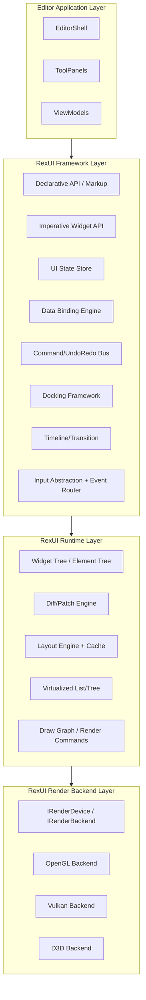
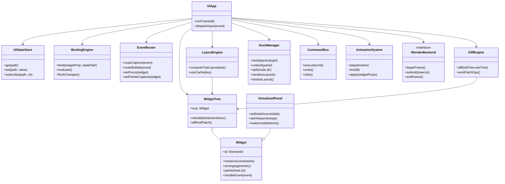
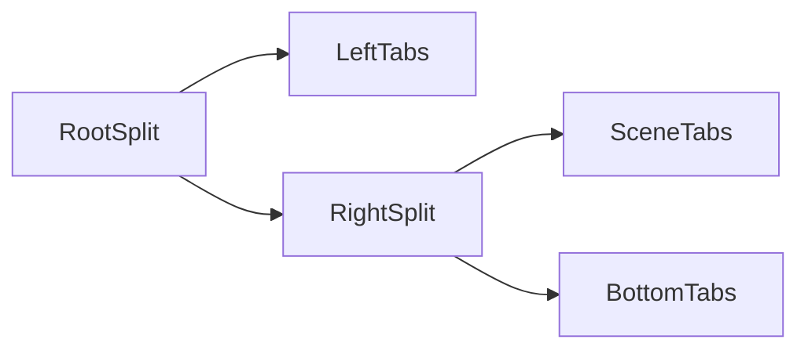

# RexUI 산업용 UI 프레임워크 설계안

## 1. 목표
- 기존 Qt 기반 에디터 UI와 **기능적·구조적 동등성(Functional & Structural Parity)** 달성
- RexUI를 단순 위젯 모음이 아닌, 엔진/툴체인 내장형 UI 프레임워크로 확장
- Unreal UMG/Slate에서 검증된 패턴을 참고하되, 외부 종속성 없이 독립 아키텍처 유지

## 2. 패리티 기준(기존 Qt 에디터 기준)
### 2.1 구조 동등성
- 상단 메뉴/툴바
- 중앙 Scene/Game 탭
- 좌측 Hierarchy(검색/선택/삭제)
- 우측 Details(Transform 편집/적용)
- 하단 Content Browser / Output Log 탭
- 설정 창(카메라 민감도/이동속도)

### 2.2 상호작용 동등성
- Entity 선택 시 Viewport 선택 동기화
- Inspector 값 변경 후 Apply 시 Transform 반영
- Add/Delete 시 Hierarchy 실시간 갱신
- 검색 필터 기반 Hierarchy 가시성 변경
- Gizmo 모드 전환(Select/Move/Rotate/Scale)
- 단축키(W/E/R, Delete, 카메라 조작) 동작

### 2.3 상태 동등성
- UI 상태(선택 엔티티, 활성 탭, 도킹 상태) 지속성
- 편집 상태가 Undo/Redo 히스토리와 동기화
- 씬 상태 변경 시 UI 자동 반영(바인딩 기반)

## 3. 아키텍처 원칙
- 선언형 + 명령형 혼합
- 상태 기반 렌더링(State-driven rendering)
- 위젯 트리 기반 계층
- 렌더러 독립(백엔드 교체 가능)
- 데이터 바인딩/명령(Command) 중심 상호작용
- 플러그인 확장 가능한 위젯/툴 등록

## 4. 상위 구조도


## 5. 모듈 분리 구조
```text
Engine/UI/
  RexUI/Core/
    Widget.h
    ElementId.h
    Geometry.h
    StyleValue.h
    Event.h
  RexUI/Framework/
    Declarative/
      UIBuilder.h
      MarkupParser.h
    State/
      UIStateStore.h
      Observable.h
      Computed.h
    Binding/
      BindingExpression.h
      BindingContext.h
    Commands/
      UICommand.h
      CommandBus.h
      UndoRedoStack.h
    Input/
      InputEvent.h
      InputMap.h
      InputRouter.h
    Docking/
      DockManager.h
      DockNode.h
      DockSerializer.h
    Animation/
      Timeline.h
      Transition.h
      Easing.h
    Plugins/
      WidgetRegistry.h
      PanelRegistry.h
      PluginHost.h
  RexUI/Runtime/
    Tree/
      WidgetTree.h
      ElementTree.h
    Diff/
      DiffEngine.h
      PatchOp.h
    Layout/
      LayoutEngine.h
      LayoutCache.h
      ConstraintSolver.h
    Virtualization/
      VirtualList.h
      VirtualTree.h
    Render/
      DrawCommand.h
      DrawListBuilder.h
      RenderGraph.h
  RexUI/Renderer/
    IRenderDevice.h
    IRenderBackend.h
    OpenGL/
      RexUIRendererGL.cpp
    Vulkan/
      RexUIRendererVK.cpp
  RexUI/Widgets/
    Basic/
    Editor/
      HierarchyView.h
      InspectorPanel.h
      DockTabBar.h
  RexUI/Integration/
    EditorBridge/
      EditorUIState.h
      EditorViewModel.h
      EditorActions.h
```

## 6. 핵심 클래스 다이어그램


## 7. 선언형 + 명령형 혼합 모델
### 7.1 선언형
- `ViewModel` 기반 UI 선언
- 상태 변경 시 Diff 엔진이 최소 패치 생성
- 예: `HierarchyPanel(viewModel)`

### 7.2 명령형
- 런타임 도킹/패널 생성, 컨텍스트 메뉴, 툴 창은 명령형 API 제공
- 예: `DockManager::spawnPanel("Profiler")`

### 7.3 공존 규칙
- 화면 구조(정적 골격)는 선언형
- 툴/패널 라이프사이클(동적)은 명령형

## 8. 스타일/테마 시스템
- 전역 `ThemeRegistry` + 로컬 오버라이드
- 토큰 기반 스타일(`Color.Surface.Primary`, `Spacing.M`)
- 다크/라이트 모드 즉시 전환
- 위젯 상태별 스타일 셀렉터
  - Normal / Hover / Active / Focused / Disabled / Error
- 스킨 패키지(JSON or binary) 로드 지원

## 9. 상태 기반 렌더링 + 바인딩
- 단방향 데이터 흐름: `StateStore -> Binding -> Widget`
- 양방향 입력은 `Command`를 통해 상태 반영
  - Widget 입력 -> CommandBus -> Domain Model -> StateStore -> UI 갱신
- 바인딩 단위
  - Property binding
  - Collection binding(Tree/List)
  - Computed binding(파생 상태)

## 10. 이벤트 시스템(캡처링/버블링)
- 이벤트 경로: Root -> Target(캡처) -> Target -> Root(버블)
- 포인터 캡처 지원(드래그/슬라이더/도킹 탭)
- 포커스 체인(키보드 탭 순회)
- 이벤트 객체
  - `handled`, `stopPropagation`, `stopImmediate`

## 11. Input Abstraction Layer
- 물리 입력(SDL/플랫폼)과 논리 입력 분리
- `InputAction`/`InputAxis` 매핑
- 키/마우스/게임패드 통합 라우팅
- 컨텍스트 기반 입력 레이어
  - `ViewportContext`, `TextEditContext`, `DockContext`

## 12. Docking 시스템 설계
- `DockNode` 트리(분할 노드 + 탭 스택 노드)
- 드래그 프리뷰/드롭 타깃/부유 창(Floating window)
- 레이아웃 직렬화/복원
- 동적 패널 생성 API



## 13. 성능 설계
### 13.1 Virtualized Rendering
- Tree/List는 가시 범위만 realize
- 아이템 재사용 풀(pool) 적용

### 13.2 Diff 기반 업데이트
- Element key 기반 트리 비교
- 변경된 서브트리만 레이아웃/페인트 재계산

### 13.3 레이아웃 캐싱
- 키: (WidgetType, StyleHash, Constraint, ContentHash)
- 스크롤/리사이즈 시 캐시 재사용

### 13.4 Draw Command 최적화
- 배치/클리핑/상태 변화 최소화
- 텍스트 아틀라스 캐시

## 14. Undo/Redo 통합
- UI 입력은 직접 모델 변경 금지, 반드시 Command로 수행
- `CommandBus`가 Undo/Redo 스택 관리
- 스택 변경 시 UI 상태 패널(Undo/Redo 가능 여부, 히스토리명) 자동 바인딩

## 15. 애니메이션/트랜지션
- 타임라인 기반 속성 애니메이션
  - Opacity, Position, Size, Color, Blur, Clip
- 상태 전이 트랜지션
  - Hover/Focus/PanelOpen/PanelClose
- 에디터 도킹/탭 전환 애니메이션 지원

## 16. 플러그인 확장 구조
- `IUIPlugin` 인터페이스
  - 위젯 등록
  - 패널 등록
  - 명령/단축키 등록
- `WidgetFactoryRegistry`로 커스텀 위젯 생성
- ABI 안정성을 위한 C API 브리지(선택)

## 17. Renderer 독립성
- `IRenderBackend` 인터페이스로 추상화
- DrawCommand는 백엔드 중립 포맷 유지
- GL/Vulkan/D3D 백엔드 교체 가능
- 텍스트 렌더링/클리핑/블렌딩은 공통 계약으로 통일

## 18. Qt 대비 패리티 매트릭스
| 항목 | Qt 기반 기존 | RexUI 목표 |
|---|---|---|
| 메뉴/툴바 | QMenuBar/QToolBar | CommandMenu/ToolStrip + ActionMap |
| 도킹 | QDockWidget | DockManager + DockNodeTree |
| 탭 | QTabWidget | TabStackWidget + DockTabs |
| 트리 | QListWidget/TreeView | VirtualTreeView + BindingCollection |
| 인스펙터 | QLineEdit/Form | PropertyGrid + TypedEditorFactory |
| 이벤트 | Qt 시그널/슬롯 | RoutedEvent + CommandBus |
| 단축키 | Qt Key Event | InputActionMap + Context |
| 테마 | QSS | ThemeToken + SkinPackage |

## 19. 단계별 구현 로드맵
### Phase 0: 패리티 복구(단기)
- Qt 에디터와 동일 UI 구조/동작 회귀
- 기존 기능 테스트 케이스 고정

### Phase 1: 프레임워크 골격(중기)
- StateStore/Binding/Diff/LayoutCache/EventRouter 도입
- 렌더 백엔드 인터페이스 분리

### Phase 2: 고급 기능(중기)
- Docking 완성, Virtualization, Undo/Redo 완전 연동
- Theme/Skin 시스템 완성

### Phase 3: 산업용 품질(중장기)
- 플러그인 SDK
- 애니메이션 타임라인 편집기
- 멀티백엔드 렌더 안정화

## 20. 수용 기준(Definition of Done)
- Qt 에디터 기능 목록 100% 패리티 통과
- 대규모 Hierarchy(예: 50k 노드)에서 프레임 유지(virtualization 적용)
- 도킹 레이아웃 저장/복원 안정성
- Undo/Redo 전 UI 상태 일관성
- 백엔드 교체(GL -> VK) 시 UI 코드 변경 최소화

## 21. 현재 코드베이스 적용 방침
- 기존 `Engine/UI/RexUI*`는 **Legacy Layer**로 유지
- 신규 프레임워크는 `Engine/UI/RexUI/` 하위 모듈로 병행 구축
- `Engine/EditorRex/rexui_main.cpp`는 점진적으로 `EditorShell`/`ViewModel` 기반으로 분리

